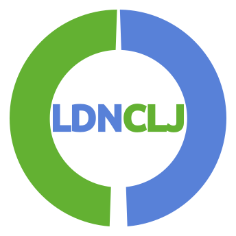

## London Clojurians logo

To identify sites and content that has been created or supported by the London Clojurians we have created a community Logo

The logo is available as [SVG](https://github.com/jr0cket/london-clojurians-logo/raw/master/london-clojurians-logo.svg) or [PNG](https://github.com/jr0cket/london-clojurians-logo/raw/master/london-clojurians-logo.png) formats.

## Copyright & Licence

Copyright © 2016 John Stevenson [@jr0cket](https://twitter.com/jr0cket)

Distributed under the [Creative Commons Attribution Share-Alike 4.0 International](https://creativecommons.org).

## Banners

The logo is also available as part of a banner that can be used to promote the London Clojure community or serve as a header / footer to any London Clojurians web sites.

The banner is available as [SVG](https://github.com/jr0cket/london-clojurians-logo/blob/master/banners/london-clojurians-banner-new.svg) or [PNG](https://github.com/jr0cket/london-clojurians-logo/blob/master/banners/london-clojurians-banner-new.png) formats.

There is also a banner specifically for Google Forms, available as [SVG](https://github.com/jr0cket/london-clojurians-logo/raw/master/banners/london-clojurians-banner-lambda-google-form.png) or [PNG](https://github.com/jr0cket/london-clojurians-logo/raw/master/banners/london-clojurians-banner-lambda-google-form.png) formats.

## Design tools

Logo's developed using [Inkscape](https://inkscape.org/), a free and open-source professional vector graphics editor for Linux, MacOSX and Windows.

## Design thoughts

The first design takes the basic outline from Clojure Berlin and replaces the middle with the short name for London Clojurians, LDNCLJ.  Once completed, this design seems to give a familiar appearance to the London Underground signage, however is different enough that it should not be infringing copyright.

The second design is a variation of the first, adding a lambda sign in the centre of the logo.  The text is highlighted and made bigger so that it is still visible at smaller resolutions (eg. such as a favicon).

The rough idea behind the third design is that the outer blue circle represents the M25 surrounding a green and vibrant Greater London.  The lambda representing the major arteries (roads) through London.

Alternatively, the design represents a stylised clock-face of the clock that surrounds Big Ben bell in the Elizabeth Tower in London.

## Early Logo designs

Several iterations of the Logo design were created to gather feedback from the London Clojurians community.  Here are some of the main stages of logo design evolution.

