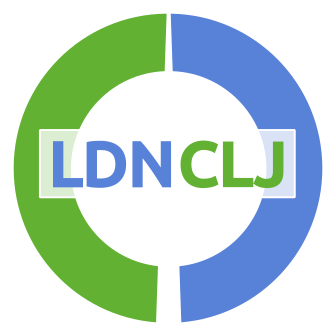
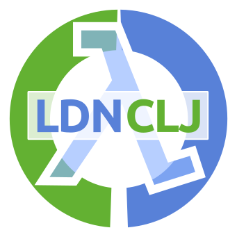
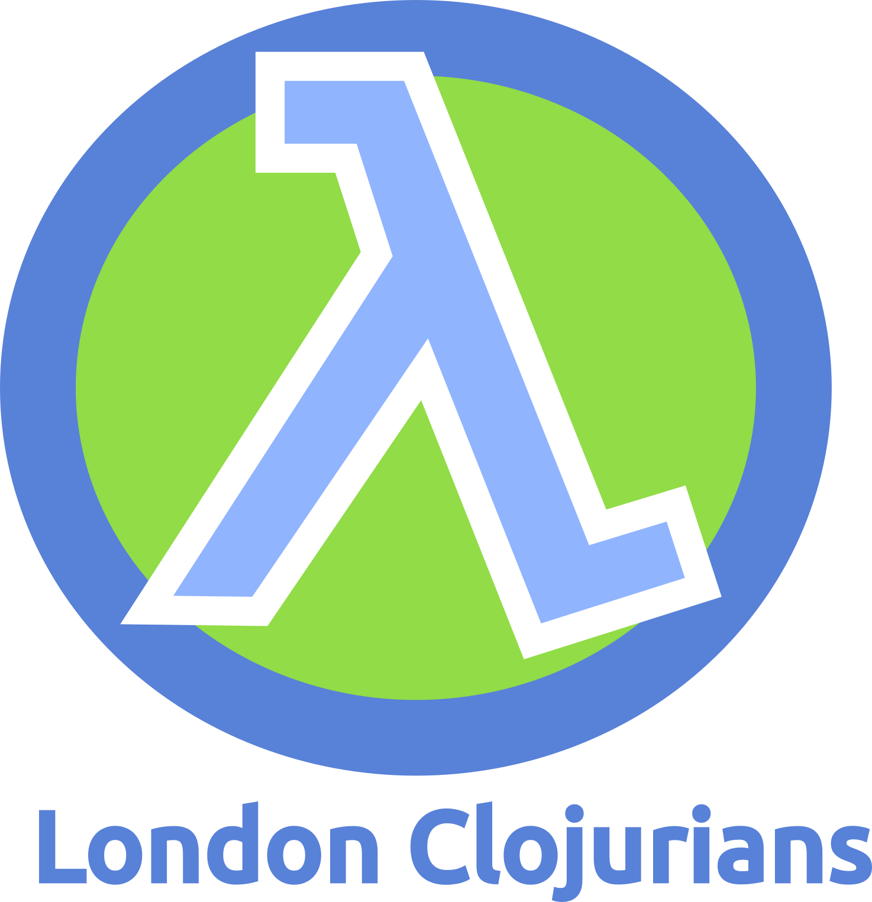

# Logo designs for the London Clojurians community

Logo designs for the London Clojurian community.

The current favorite designs are:

## Design tools

Logo's developed using [Inkscape](https://inkscape.org/), a free and open-source professional vector graphics editor for Linux, MacOSX and Windows.

## Design thoughts

The first design takes the basic outline from Clojure Berlin and replaces the middle with the short name for London Clojurians, LDNCLJ.  Once completed, this design seems to give a familiar appearance to the London Underground signage, however is different enough that it should not be infringing copyright.

The second design is a variation of the first, adding a lambda sign in the centre of the logo.  The text is highlighted and made bigger so that it is still visible at smaller resolutions (eg. such as a favicon).

The rough idea behind the third design is that the outer blue circle represents the M25 surrounding a green and vibrant Greater London.  The lambda representing the major arteries (roads) through London.

Alternatively, the design represents a stylised clock-face of the clock that surrounds Big Ben bell in the Elizabeth Tower in London.

## Copyright & Licence

Copyright © 2016 John Stevenson [@jr0cket](https://twitter.com/jr0cket)

Distributed under the [Creative Commons Attribution Share-Alike 4.0 International](https://creativecommons.org).
